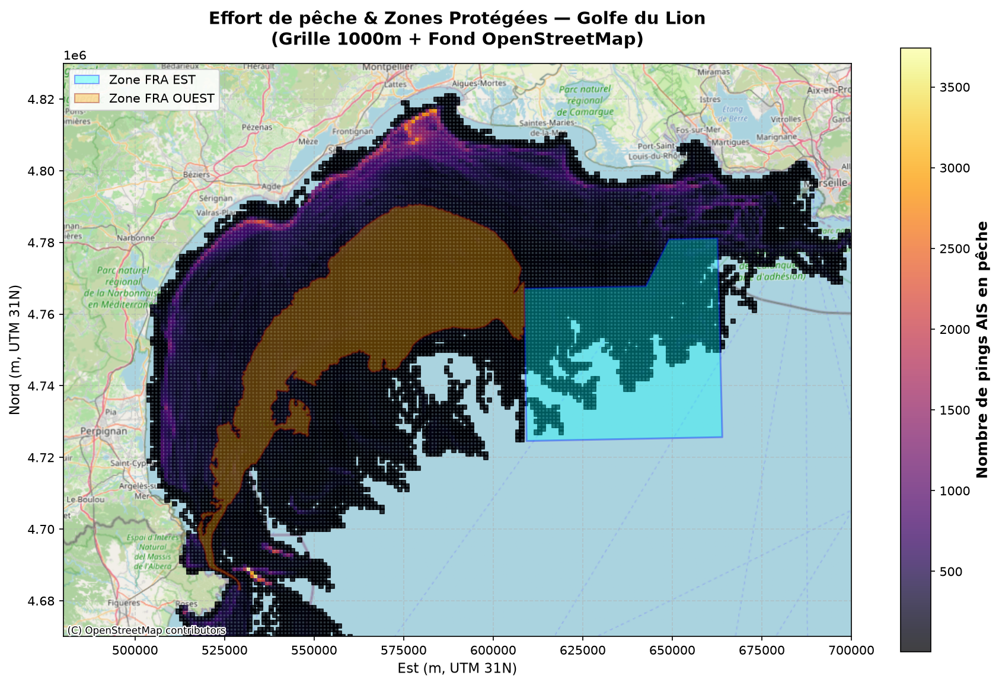
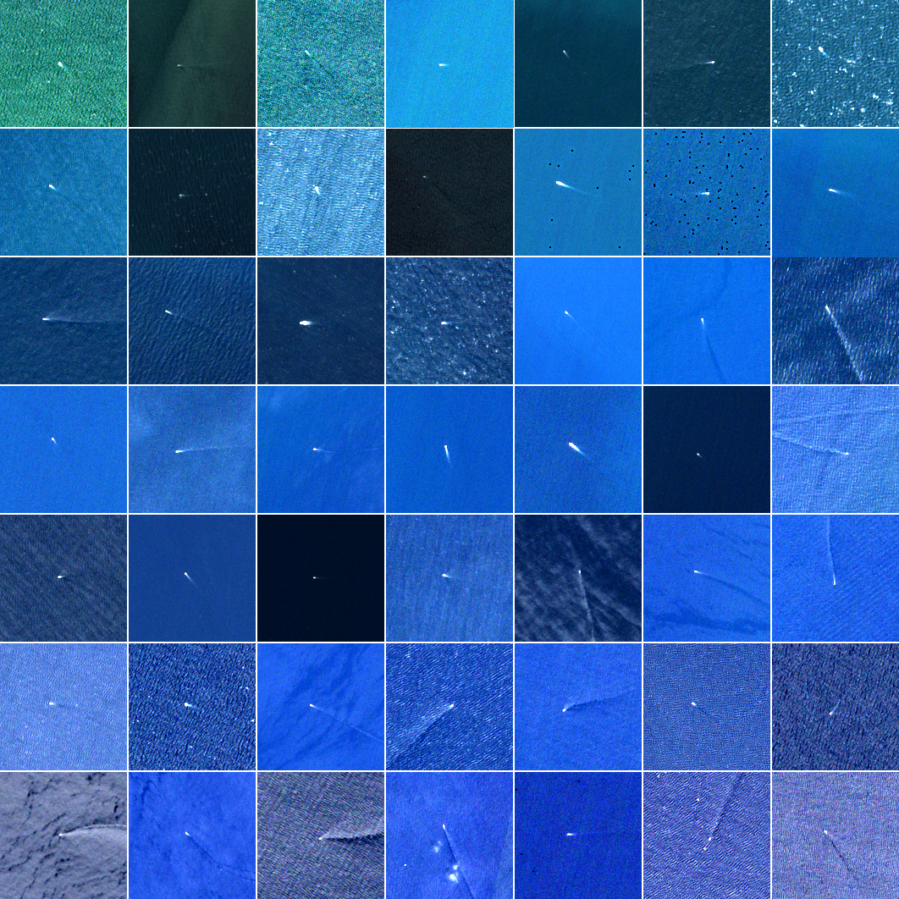
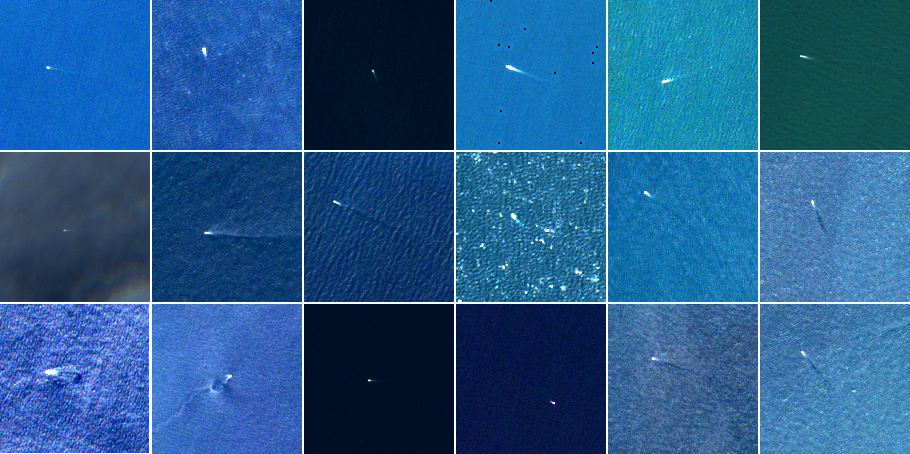
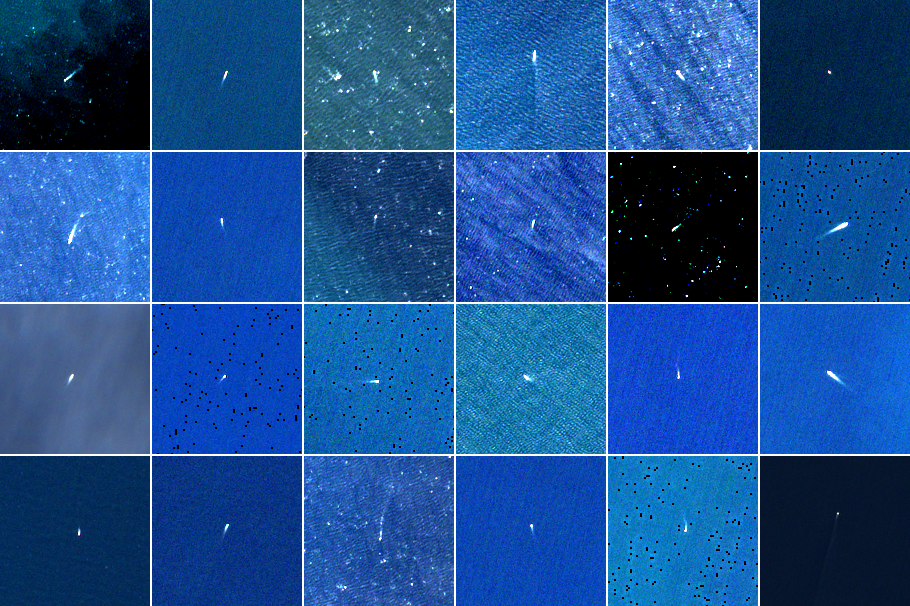

# Chalutage potentiel dans zone protégée française

⚠️ Avertissement : Ce document relève d'une recherche exploratoire et ne constitue en aucun cas une accusation d'infraction. Les navires identifiés peuvent pratiquer le chalutage pélagique, qui est autorisé toute l'année dans ces zones

## La zone et les règles

Le golfe du Lion abrite une zone de pêche à accès réglementé (FRA), créée en 2009 par la Commission générale des pêches pour la Méditerranée avec comme objectif de protéger les stocks démersaux (poissons de fond). 

La mesure de 2009 gelait l'effort de pêche au niveau de 2008. Ce n'était pas un quota de captures, mais une limite d'effort, avec contrôle d'accès à la zone.

En décembre 2019, la France a ajouté une fermeture saisonnière : interdiction du chalutage démersal (le chalutage de fond) du 1er novembre au 30 avril, dans la FRA et l'a étendue légèrement au nord (c’est la FRA EST actuelle qui fait 2500km^2).

Une deuxième FRA adjacente a été créée (la FRA OUEST) par la même occasion, définie par les eaux avec une profondeur entre 90 et 100m entre la FRA EST et la frontière franco-espagnole où il est interdit de pêcher 8 mois par an (entre novembre à juin), d'une surface de environ 2500km^2 aussi.

A noter que d’autres limites aussi s'appliquent aux chalutiers français en Méditerranée :
* 250 jours de sortie maximum par an
* 5 jours par semaine (pas le week-end, pas les jours fériés)
* 15 heures par jour de pêche au chalut, 18h en dérogation

### Visualisation des zones protégées
 

## Comment on suit les bateaux

On a cherché les bateaux ayant une autorisation de chalutage pélagique ou démersale dans le registre CGPM pour la zone GSA7 (Golfe du Lion). On a récupéré leurs AIS depuis le 1er janvier 2020. Les données AIS proviennent de Global Fishing Watch. Sources selon les périodes : Orbcomm et Spire (2016-2022), Spire Global (depuis 2023).

Un algorithme K-Means a classé les positions de chaque bateau en 4 groupes selon la vitesse : arrêt/port, pêche, transit, dérive.

Une marge de sécurité de 500 mètres a été retirée à l'intérieur de la limite des FRA, pour exclure les positions ambiguës liées à l'imprécision du GPS.

On définit un évènement de pêche avec au moins 3 points consécutifs à une vitesse compatible avec le chalutage, sur une durée d'au moins 2 heures à l’intérieur de la FRA.

Les positions AIS suspectes ont été recoupées avec des images satellite Sentinel-2, pour confirmer visuellement la présence des navires. Des images de chalutage dans d'autres zones du golfe du Lion ont servi de point de comparaison.

### Images chalutage normal dans zone autorisé :
 

### Images chalutage suspecté :

## Les chiffres

### FRA EST :
* **88 événements** de chalutage suspecté.
* **306 heures** cumulées. Dans une zone où le chalutage de fond est interdit six mois par an.

Deux navires concentrent l'essentiel des cas : le **JULIARTH II** (53 événements, 189 heures) et le **LOUIS ELIE II** (15 événements, 52 heures). Huit autres bateaux totalisent entre 1 et 5 événements de pêche chacun.

### FRA OUEST :
* **511 événements** de chalutage suspecté.
* **2 415 heures** cumulées. Dans la bande 90-100m entre la FRA et la frontière franco-espagnole, où le chalutage de fond est interdit huit mois par an.

Deux navires concentrent l'essentiel des cas : le **LOUIS ELIE II** (127 événements, 517 heures) et le **GIOVANNI-JEAN** (76 événements, 391 heures). Les 29 autres bateaux totalisent entre 1 et 40 événements de pêche chacun, avec des cas notables comme le **RAYMOND ELISE IV** (40 événements, 164 heures) et le **PAOLO MANOE** (39 événements, 214 heures).

---

> **ATTENTION :**
> Certains bateaux avec les plus d'infractions possèdent une double autorisation chalutage pélagique et chalutage démersale. Le chalutage pélagique étant autorisé toute l’année dans les deux FRA nous force à être extrêmement prudent avant d'avancer la moindre accusation. 
> 
> Des données VMS pourrait permettre potentiellement de mieux distinguer les types de chalutages mais il faudrait la collaboration des autorités françaises en particulier du CNSP, mais celui-ci ne repond pas aux sollicitations. L’autorité européenne (l’EFCA), avec qui la communication est bien plus fluide, m’a explicitement dit que les données sont la propriété des autorités françaises et bien qu'ils possèdent ces données ils n'ont pas le droit de les transmettre. 
> 
> Les données des logbooks seraient idéale afin de distinguer plus facilement encore la pêche pélagique de la pêche démersale. Le CNSP détient ces logbooks.

---

## Les contrôles officiels

Le Centre national de surveillance des pêches (CNSP), basé à Étel, suit les données VMS en temps réel. Il coordonne les patrouilles avec les unités littorales des affaires maritimes, la Gendarmerie maritime, la Douane et la Marine nationale.

Chiffres 2024 :
* **439 contrôles en mer**, 51 infractions relevées (11,62 %)
* **346 contrôles à terre** (ports, marchés), 28 infractions relevées (8,09 %)

Les données publiques ne précisent pas combien de ces contrôles ont eu lieu spécifiquement dans la FRA pendant la période de fermeture.

## Subventions

Vérification sommaire effectuée : aucun des chalutiers concernés ne touche de subvention pour pêche durable.

## Limites

* Les données AIS de Global Fishing Watch combinent plusieurs sources, chacune avec ses propres limites de précision et de couverture.
* L'analyse repose sur des indices de comportement (vitesse, trajectoire), pas sur une observation directe de l'activité de pêche.
* Les données VMS et les logbooks, qui permettraient de trancher avec plus de certitude, restent inaccessibles au public.

## Droit de réponse

Je n'ai contacté aucun des bateaux mentionnés.
